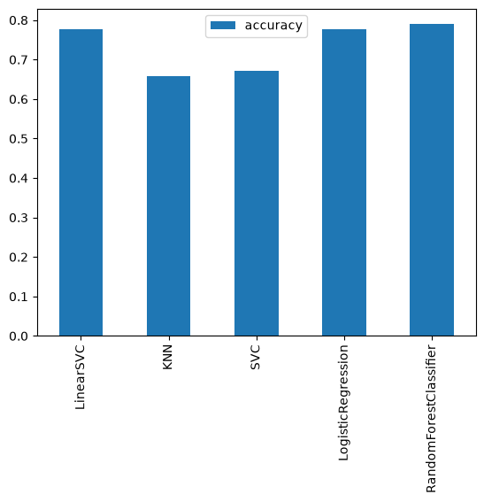
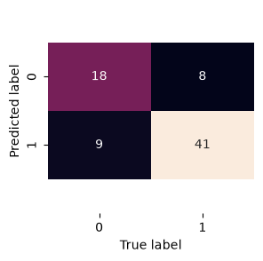

# Heart Disease Classification

Predicting the presence of heart disease from patient clinical data — comparing five classification models, tuning the best one, and evaluating it beyond a single accuracy number.

**Built with:** Python, pandas, scikit-learn, seaborn, joblib

**Best result:** Logistic Regression, tuned with `RandomizedSearchCV`, reaching **83.2% cross-validated accuracy** (up from 77.6% untuned) and a **0.83 F1 score** on the held-out test set.

## The problem

Given 13 clinical features (age, cholesterol, resting blood pressure, chest pain type, and others) for 303 patients, predict whether each patient has heart disease. This is a binary classification problem, and the dataset is the well-known [UCI Heart Disease dataset](https://archive.ics.uci.edu/dataset/45/heart+disease).

## Approach

**1. Baseline comparison.** Rather than assuming which model would work best, five classifiers were trained on an identical train/test split and scored on accuracy:

| Model | Accuracy |
|---|---|
| Random Forest | 78.9% |
| **Logistic Regression** | **77.6%** |
| Linear SVC | 77.6% |
| SVC | 67.1% |
| KNN | 65.8% |



Random Forest edged out slightly ahead here, but Logistic Regression was chosen for tuning — it's simpler, faster, and more interpretable, with only a marginal accuracy gap. That trade-off (a small accuracy cost for a much more transparent model) is a real decision worth making, not just a default.

**2. Hyperparameter tuning.** Instead of manually guessing values, `RandomizedSearchCV` searched 5 candidate configurations across a range of `C` values with 5-fold cross-validation. Best configuration found: `C=0.234`, `solver='liblinear'` — pushing cross-validated accuracy to **83.2%**.

**3. Evaluation beyond accuracy.** Accuracy alone hides how a model fails. On the test set (76 patients), the tuned model's full breakdown:



| Metric | Score |
|---|---|
| Precision | 0.84 |
| Recall | 0.82 |
| F1 Score | 0.83 |

Precision of 0.84 means when the model predicts heart disease, it's right 84% of the time. Recall of 0.82 means it correctly catches 82% of actual heart disease cases — in a medical context, missed positives (false negatives) are usually the costlier mistake, so recall is arguably the more important number to watch here, not raw accuracy.

**4. Persistence.** The final model is exported with `joblib`, so it can be reloaded and reused without retraining from scratch.

## Project structure

```
heart_disease_classification/
├── data/
│   └── heart-disease.csv
├── images/
│   ├── model-comparison.png
│   └── confusion-matrix.png
├── heart-disease-classification.ipynb
├── heart-disease-model.joblib
├── .gitignore
├── LICENSE
└── README.md
```

## Running it

```bash
git clone https://github.com/Mahdi-Darwish/heart_disease_classification.git
cd heart_disease_classification

python3 -m venv venv
source venv/bin/activate          # on Windows: venv\Scripts\activate

pip install pandas numpy matplotlib seaborn scikit-learn joblib jupyter
jupyter notebook heart-disease-classification.ipynb
```

## What I'd do with more time

- **ROC curve and AUC score** — a threshold-independent view of the precision/recall trade-off, useful for deciding where to set the classification cutoff in a real clinical setting.
- **Cross-validated precision/recall/F1**, not just cross-validated accuracy — a single train/test split can make a model look better or worse than it really is by chance.
- **GridSearchCV over a narrower range** once `RandomizedSearchCV` identifies roughly where the good hyperparameters live, to fine-tune further.
- **A larger dataset.** 303 patients is small for a clinical model; more data would make every metric above more trustworthy.

## Acknowledgements

Exercise structure and dataset from Daniel Bourke's [Zero to Mastery Machine Learning](https://github.com/mrdbourke/zero-to-mastery-ml) course.

## License

This project is licensed under the MIT License — see [LICENSE](LICENSE) for details.
